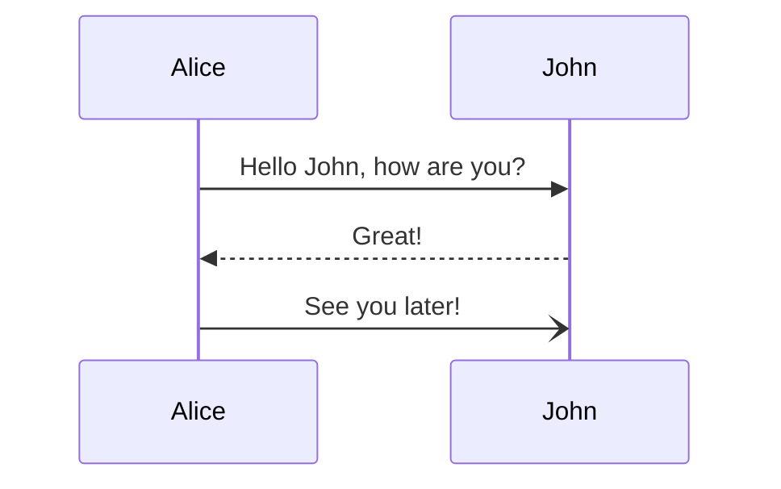
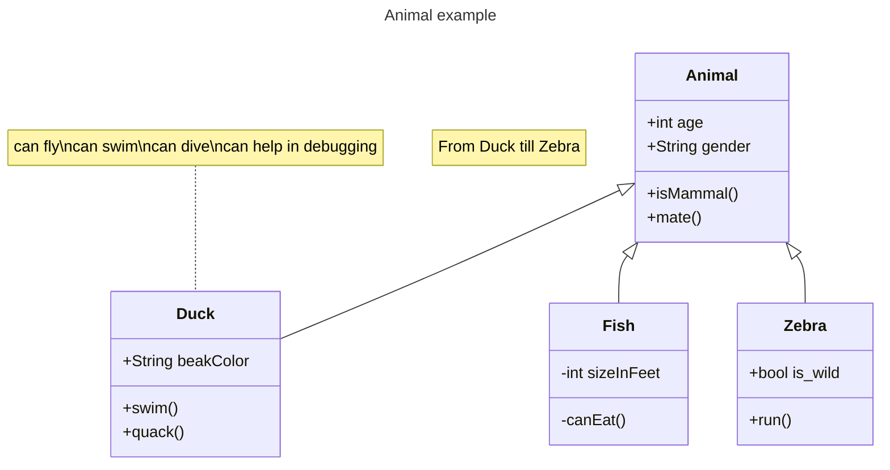
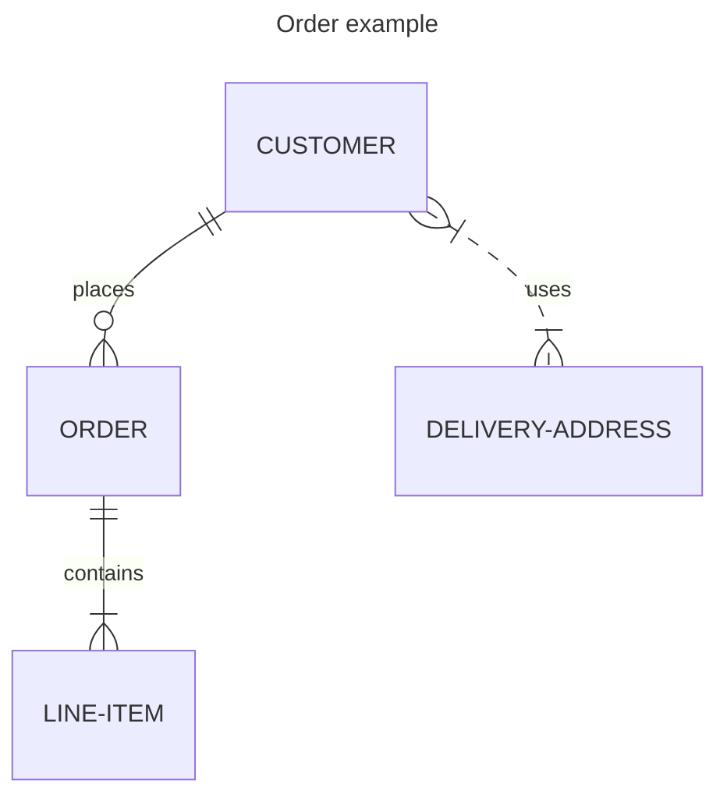

# resilience4j

## context  

## references

| Item | Link(s) |
| :--- | ------- |
|  resilience4j    |  [resilience4j](https://github.com/rock-hu/technology_radar/blob/master/docs/resilience4j.md)       |
|||