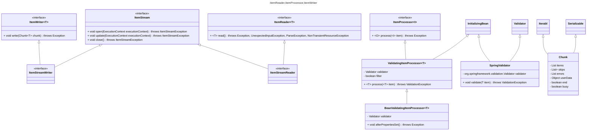
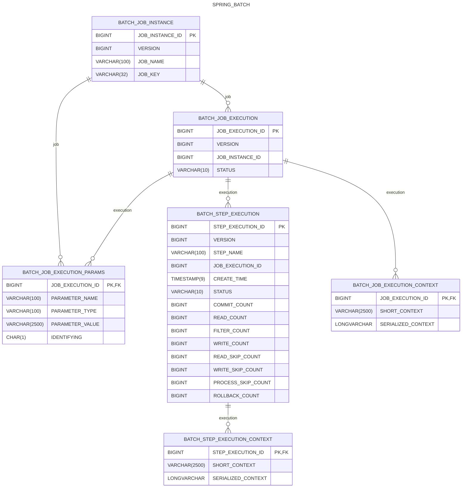

# spring-batch

## dependencies

- spring-batch-core
- spring-batch-infrastructure
- spring-batch-integration


```dotnetcli
<|-- inheritance
*-- composition
o-- aggregation
--> association
..> dependency
..|> realization
-- solid link
.. dashed link
```


## context



## partition

```mermaid
---
title: Partitioner
---
classDiagram
    class PartitionHandler {
        <<interface>>
        + Collection<StepExecution> handle(StepExecutionSplitter stepSplitter,StepExecution stepExecution) throws Exception
    }
    note "Set<StepExecution> stepExecutions = stepSplitter.split(managerStepExecution, gridSize)\nreturn doHandle(managerStepExecution, stepExecutions)"
    class AbstractPartitionHandler implements PartitionHandler {
        # abstract Set<StepExecution> doHandle(StepExecution managerStepExecution,Set<StepExecution> partitionStepExecutions) throws Exception
        + Collection<StepExecution> handle(final StepExecutionSplitter stepSplitter,final StepExecution managerStepExecution) throws Exception
    }
    note "for (StepExecution stepExecution : partitionStepExecutions) {\n    FutureTask<StepExecution> task = createTask(step, stepExecution);\n}"
    class TaskExecutorPartitionHandler extends AbstractPartitionHandler implements StepHolder, InitializingBean {
        - TaskExecutor taskExecutor = new SyncTaskExecutor()
        - Step step
        # Set<StepExecution> doHandle(StepExecution managerStepExecution,Set<StepExecution> partitionStepExecutions) throws Exception
        # FutureTask<StepExecution> createTask(final Step step, final StepExecution stepExecution)
    }


    note "for (StepExecution stepExecution : partitionStepExecutions) {\n    Message<StepExecutionRequest> request = createMessage(count++, partitionStepExecutions.size(),new StepExecutionRequest(stepName, stepExecution.getJobExecutionId(), stepExecution.getId()),replyChannel);\nmessagingGateway.send(request);\n}"
    class MessageChannelPartitionHandler extends AbstractPartitionHandler implements InitializingBean {
        - MessagingTemplate messagingGateway
        - PollableChannel replyChannel
        - String stepName
        - long pollInterval = 10000
        - JobExplorer jobExplorer
        - DataSource dataSource
        + void afterPropertiesSet()
        # Set<StepExecution> doHandle(StepExecution managerStepExecution,Set<StepExecution> partitionStepExecutions) throws Exception
        - Set<StepExecution> pollReplies(final StepExecution managerStepExecution, final Set<StepExecution> split) throws Exception
        - Set<StepExecution> receiveReplies(PollableChannel currentReplyChannel)
        - Message<StepExecutionRequest> createMessage(int sequenceNumber, int sequenceSize,StepExecutionRequest stepExecutionRequest, PollableChannel replyChannel)
    }
    
    class StepExecutionSplitter {
        <<interface>>
        + String getStepName()
        + Set<StepExecution> split(StepExecution stepExecution,int gridSize) throws JobExecutionException
    }
    class Partitioner {
        <<interface>>
        + Map<String, ExecutionContext> partition(int gridSize)
    }
    class PartitionNameProvider {
        <<interface>>
         + Collection<String> getPartitionNames(int gridSize)
    }
    class SimplePartitioner implements Partitioner {
     - static final String PARTITION_KEY = "partition"
     + Map<String, ExecutionContext> partition(int gridSize)
    }
    class MultiResourcePartitioner implements Partitioner {
     - static final String DEFAULT_KEY_NAME = "fileName"
     - static final String PARTITION_KEY = "partition"
     - Resource[] resources = new Resource[0]
     - String keyName = DEFAULT_KEY_NAME
     + Map<String, ExecutionContext> partition(int gridSize)
    }

    MultiResourcePartitioner -> Partitioner : partition(int gridSize)
    SimplePartitioner -> Partitioner : partition(int gridSize)
    AbstractPartitionHandler -> PartitionHandler : doHandle(StepExecution managerStepExecution,Set<StepExecution> partitionStepExecutions)
```

## observability

```mermaid
---
title: BatchMetrics
---
classDiagram
    class BatchMetrics {
        + static final String METRICS_PREFIX = "spring.batch."
        + static Timer createTimer(MeterRegistry meterRegistry, String name, String description, Tag... tags)
        + static Counter createCounter(MeterRegistry meterRegistry, String name, String description, Tag... tags)
        + static Observation createObservation(String name, BatchJobContext context,ObservationRegistry observationRegistry)
        + static Observation createObservation(String name, BatchStepContext context,ObservationRegistry observationRegistry)
        + static Timer.Sample createTimerSample(MeterRegistry meterRegistry)
        + static LongTaskTimer createLongTaskTimer(MeterRegistry meterRegistry, String name, String description,Tag... tags)
        + static Duration calculateDuration(LocalDateTime startTime, LocalDateTime endTime)
        + static String formatDuration(Duration duration)
    }
    class BatchJobObservation implements ObservationDocumentation {
        <<enumeration>>
    }
    class BatchJobObservationConvention<BatchJobContext> extends ObservationConvention {
        <<interface>>
        + boolean supportsContext(Observation.Context context)
    }
    class DefaultBatchJobObservationConvention implements BatchJobObservationConvention {

    }
    class BatchStepObservation implements ObservationDocumentation {
        <<enumeration>>
    }
    class BatchStepObservationConvention<BatchStepContext> extends ObservationConvention {
        <<interface>>
        + boolean supportsContext(Observation.Context context)
    }
    class DefaultBatchStepObservationConvention implements BatchStepObservationConvention {

    }
```

<https://github.com/spring-projects/spring-batch/blob/main/spring-batch-core/src/main/resources/org/springframework/batch/core/schema-h2.sql>

```sql
CREATE TABLE BATCH_JOB_INSTANCE  (
 JOB_INSTANCE_ID BIGINT GENERATED BY DEFAULT AS IDENTITY PRIMARY KEY ,
 VERSION BIGINT ,
 JOB_NAME VARCHAR(100) NOT NULL,
 JOB_KEY VARCHAR(32) NOT NULL,
 constraint JOB_INST_UN unique (JOB_NAME, JOB_KEY)
) ;

CREATE TABLE BATCH_JOB_EXECUTION  (
 JOB_EXECUTION_ID BIGINT GENERATED BY DEFAULT AS IDENTITY PRIMARY KEY ,
 VERSION BIGINT  ,
 JOB_INSTANCE_ID BIGINT NOT NULL,
 CREATE_TIME TIMESTAMP(9) NOT NULL,
 START_TIME TIMESTAMP(9) DEFAULT NULL ,
 END_TIME TIMESTAMP(9) DEFAULT NULL ,
 STATUS VARCHAR(10) ,
 EXIT_CODE VARCHAR(2500) ,
 EXIT_MESSAGE VARCHAR(2500) ,
 LAST_UPDATED TIMESTAMP(9),
 constraint JOB_INST_EXEC_FK foreign key (JOB_INSTANCE_ID)
 references BATCH_JOB_INSTANCE(JOB_INSTANCE_ID)
) ;

CREATE TABLE BATCH_JOB_EXECUTION_PARAMS  (
 JOB_EXECUTION_ID BIGINT NOT NULL ,
 PARAMETER_NAME VARCHAR(100) NOT NULL ,
 PARAMETER_TYPE VARCHAR(100) NOT NULL ,
 PARAMETER_VALUE VARCHAR(2500) ,
 IDENTIFYING CHAR(1) NOT NULL ,
 constraint JOB_EXEC_PARAMS_FK foreign key (JOB_EXECUTION_ID)
 references BATCH_JOB_EXECUTION(JOB_EXECUTION_ID)
) ;

CREATE TABLE BATCH_STEP_EXECUTION  (
 STEP_EXECUTION_ID BIGINT GENERATED BY DEFAULT AS IDENTITY PRIMARY KEY ,
 VERSION BIGINT NOT NULL,
 STEP_NAME VARCHAR(100) NOT NULL,
 JOB_EXECUTION_ID BIGINT NOT NULL,
 CREATE_TIME TIMESTAMP(9) NOT NULL,
 START_TIME TIMESTAMP(9) DEFAULT NULL ,
 END_TIME TIMESTAMP(9) DEFAULT NULL ,
 STATUS VARCHAR(10) ,
 COMMIT_COUNT BIGINT ,
 READ_COUNT BIGINT ,
 FILTER_COUNT BIGINT ,
 WRITE_COUNT BIGINT ,
 READ_SKIP_COUNT BIGINT ,
 WRITE_SKIP_COUNT BIGINT ,
 PROCESS_SKIP_COUNT BIGINT ,
 ROLLBACK_COUNT BIGINT ,
 EXIT_CODE VARCHAR(2500) ,
 EXIT_MESSAGE VARCHAR(2500) ,
 LAST_UPDATED TIMESTAMP(9),
 constraint JOB_EXEC_STEP_FK foreign key (JOB_EXECUTION_ID)
 references BATCH_JOB_EXECUTION(JOB_EXECUTION_ID)
) ;

CREATE TABLE BATCH_STEP_EXECUTION_CONTEXT  (
 STEP_EXECUTION_ID BIGINT NOT NULL PRIMARY KEY,
 SHORT_CONTEXT VARCHAR(2500) NOT NULL,
 SERIALIZED_CONTEXT LONGVARCHAR ,
 constraint STEP_EXEC_CTX_FK foreign key (STEP_EXECUTION_ID)
 references BATCH_STEP_EXECUTION(STEP_EXECUTION_ID)
) ;

CREATE TABLE BATCH_JOB_EXECUTION_CONTEXT  (
 JOB_EXECUTION_ID BIGINT NOT NULL PRIMARY KEY,
 SHORT_CONTEXT VARCHAR(2500) NOT NULL,
 SERIALIZED_CONTEXT LONGVARCHAR ,
 constraint JOB_EXEC_CTX_FK foreign key (JOB_EXECUTION_ID)
 references BATCH_JOB_EXECUTION(JOB_EXECUTION_ID)
) ;

```

```dotnetcli
|o o| Zero or one
|| || Exactly one
}o o{ Zero or more (no upper limit)
}| |{ One or more (no upper limit)
```



## references

| Item         | Link(s)                                   |
| :----------- | ----------------------------------------- |
| spring-batch | <https://spring.io/projects/spring-batch> |
