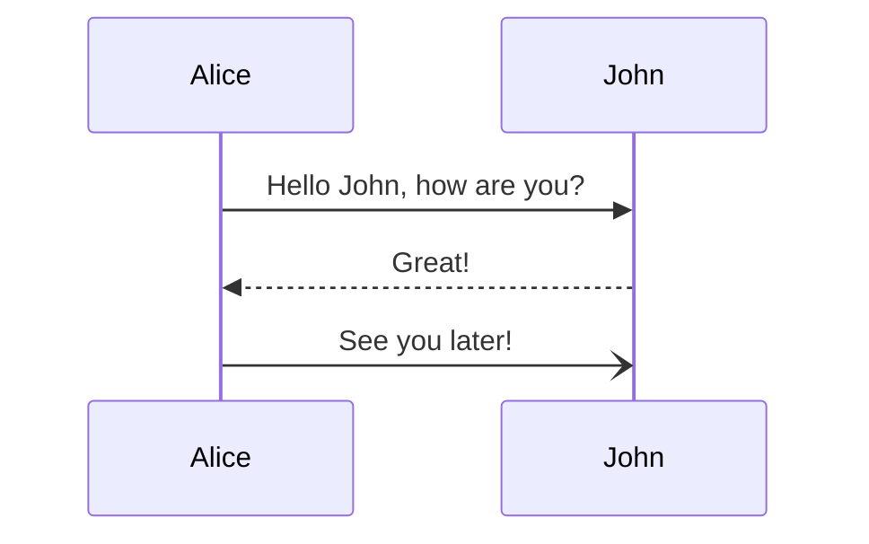
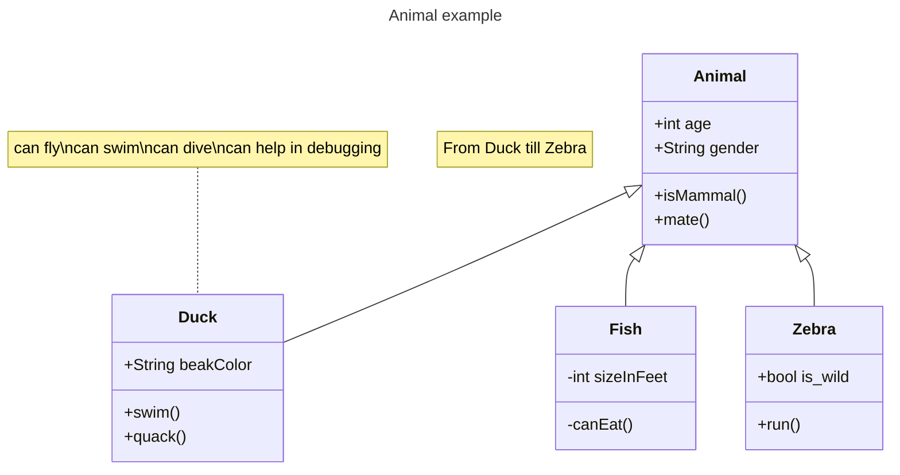
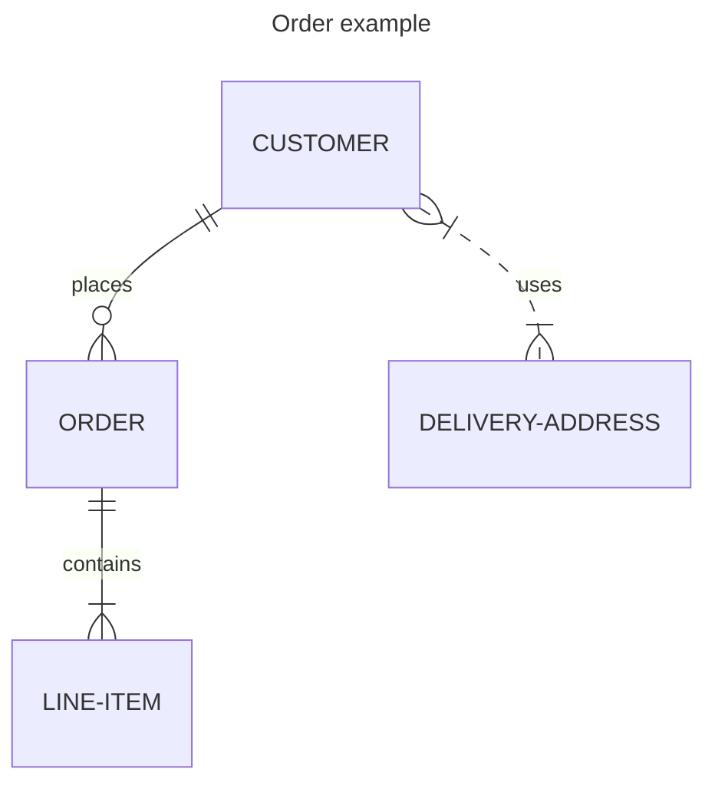

# spring-integration

## dependencies

- spring-integration-amqp
- spring-integration-camel
- spring-integration-cassandra
- spring-integration-core
- spring-integration-debezium
- spring-integration-event
- spring-integration-feed
- spring-integration-file
- spring-integration-ftp
- spring-integration-graphql
- spring-integration-groovy
- spring-integration-hazelcast
- spring-integration-http
- spring-integration-ip
- spring-integration-jdbc
- spring-integration-jms
- spring-integration-jmx
- spring-integration-jpa
- spring-integration-kafka
- spring-integration-mail
- spring-integration-mongodb
- spring-integration-mqtt
- spring-integration-r2dbc
- spring-integration-redis
- spring-integration-rsocket
- spring-integration-scripting
- spring-integration-sftp
- spring-integration-smb
- spring-integration-stomp
- spring-integration-stream
- spring-integration-syslog
- spring-integration-test
- spring-integration-test-support
- spring-integration-webflux
- spring-integration-websocket
- spring-integration-ws
- spring-integration-xml
- spring-integration-xmpp
- spring-integration-zeromq
- spring-integration-zip
- spring-integration-zookeeper


## context  








```mermaid

```

## references

| Item | Link(s) |
| :--- | ------- |
|      |         |
